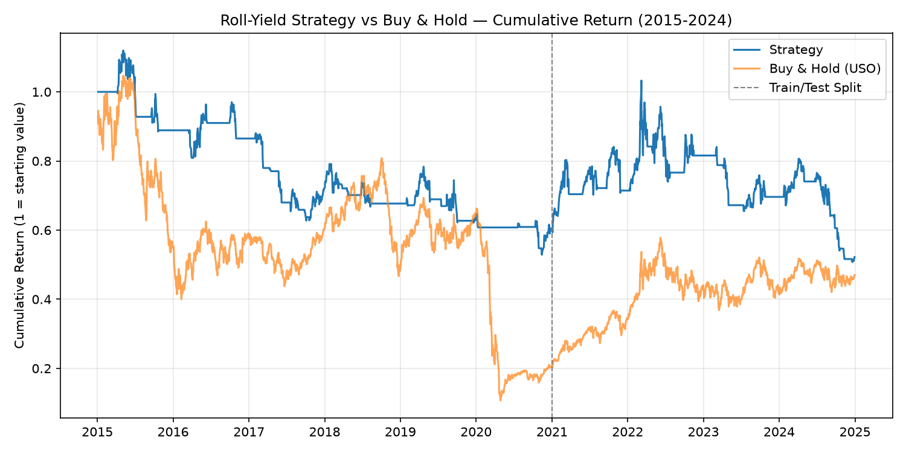

# Systematic Commodity Basis Backtester

A systematic roll-yield strategy on crude oil futures, built and validated on real market data, including an honest investigation into *why* the result looks the way it does, not just what the headline number says.

## Summary

This project tests whether a simple, rules-based roll-yield signal, going long when the futures curve is in backwardation, flat when in contango, can reduce drawdown relative to a passive buy-and-hold position in crude oil, after accounting for transaction costs and a systematic options-based tail-risk hedge.

**Data:** USO (front-month crude oil ETF) and USL (12-month average crude oil ETF), 2015–2024, sourced via `yfinance`. The USO/USL ratio is used as a real-market roll-yield proxy.

**Method:** Signal is smoothed over a 5-day rolling window to reduce whipsaw, tested with a strict 2015–2020 in-sample / 2021–2024 out-of-sample split to guard against overfitting, and costed with both a transaction cost assumption (5bps per round-turn) and a Black-Scholes-priced put hedge drag.

## Results

| | Strategy | Buy & Hold |
|---|---|---|
| Full period Sharpe (2015–2024) | -0.21 | 0.01 |
| Full period Max Drawdown | -54.7% | -89.8% |
| In-sample Sharpe (2015–2020) | -0.42 | — |
| Out-of-sample Sharpe (2021–2024) | -0.02 | — |

**The headline finding is drawdown reduction, not return generation.** Risk-adjusted returns stayed negative in both periods — unsurprising, since crude oil ETFs were structurally weak across most of 2015–2024 (sustained contango, the April 2020 negative-price event). What the strategy actually demonstrates is a consistent, non-degrading reduction in maximum drawdown: roughly half the max loss of buy-and-hold, holding up out-of-sample rather than only working in the period it was designed on.



## Why the out-of-sample period looks better

The natural first guess is that 2021–2024 performance was driven entirely by the 2022 energy crisis, when crude oil moved into deep backwardation. I checked this directly rather than assuming it:

- % of time long in 2022: 60.2%
- % of time long in 2023: 36.4%

If the result were purely "the strategy got lucky riding 2022's backwardation spike," you'd expect elevated long exposure persisting into 2023 as well. Instead, exposure drops well below 50% in 2023 — the signal is rotating in and out of positions across both years rather than sitting in one persistent regime. This doesn't prove the signal has a robust edge, but it does rule out the simplest "it just got lucky on one macro event" explanation.

## What this project deliberately does *not* claim

- It does not claim positive risk-adjusted returns — the Sharpe ratio stayed negative in both sample periods, and that's reported plainly rather than hidden behind a more flattering headline metric.
- It does not tune parameters after seeing results. The 60-day normalization window, 5-day smoothing window, 5% OTM strike, and cost assumptions were fixed before running the out-of-sample test, and were not adjusted afterward to improve the reported numbers.
- It does not claim the out-of-sample improvement proves a durable edge — the regime check above shows the result is more nuanced than pure backtest luck, but a longer out-of-sample window would be needed to make a stronger claim.

## Methodology detail

**Signal:**
```
roll_proxy = USO / USL
roll_normalized = roll_proxy / roll_proxy.rolling(60).mean() - 1
smoothed_signal = roll_normalized.rolling(5).mean()
position = long if smoothed_signal > 0, else flat
```

**Tail-risk hedge:** When long, a 30-day, 5%-out-of-the-money put is priced via Black-Scholes using 30-day realized volatility, and its theta-equivalent daily cost is deducted from strategy returns.

**Transaction costs:** 5bps per round-turn trade, applied on every position change.

**Validation:** Strict chronological train/test split — 2015–2020 in-sample, 2021–2024 out-of-sample, no parameter re-fitting after the split.

## Stack

Python · pandas · NumPy · SciPy (Black-Scholes pricing) · yfinance

## Possible extensions

- Test the same signal logic on other commodity pairs (natural gas, agricultural commodities) to see whether the drawdown-reduction effect generalizes beyond crude oil
- Extend the out-of-sample window as more data becomes available
- Compare against a simpler benchmark (e.g. constant 50% hedge ratio) to isolate how much of the drawdown reduction comes from the signal itself versus the options hedge
